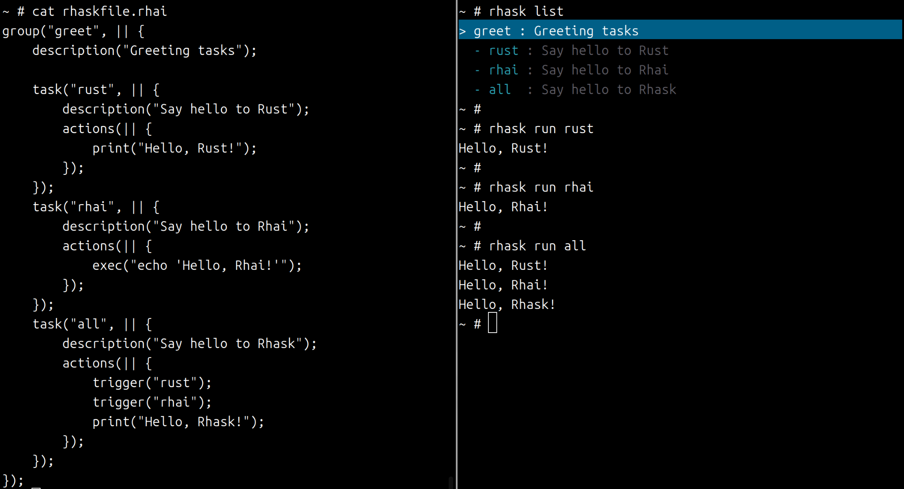

# Rhask – Rhai-based Task Runner

Rhask is a lightweight task runner that lets you describe tasks in [Rhai](https://rhai.rs/) and execute them from a Rust CLI. Tasks and groups can be nested freely, and every entry can be invoked by its fully qualified name such as `group.task`. When a leaf name is unique, you can also call it without the prefix.



---

## Quick Start (Install / Setup)

```bash
# Install from crates.io
cargo install rhask

# Example: list tasks at the project root
rhask list

# Example: run a task
rhask run <task>
```

- Place `rhaskfile.rhai` at your repository root (copy `rhaskfile_demo.rhai` or `rhaskfile_sample.rhai` to get started).
- To try the demo without touching your root, run `rhask -f ./rhaskfile_demo.rhai list`.
- You can skip the `run` subcommand and execute tasks as `rhask <task>`; it behaves exactly like `rhask run <task>`.
- Declare `default_task("group.task")` at the top level (or inside imported files) to automatically run that task when `rhask` is invoked without additional arguments. If `default_task` is not set, `rhask` with no arguments falls back to listing tasks.

---

## Features

- Task definitions live in `rhaskfile.rhai` at the repository root.
- At startup Rhask searches the current directory and walks up parent directories until it finds `rhaskfile.rhai` (override with `-f` / `--file`).
- `rhask list` renders tasks and groups as a tree.
- `rhask list --flat` (or `-F`) prints each task as `full.path` followed by a space-aligned description (colorized on TTY), which is convenient for piping into `fzf`, `peco`, etc.
- `rhask run` (or the shorthand `rhask <task>`) accepts both short names and fully qualified names. When a name is ambiguous, Rhask prints the candidates and asks you to re-run with a full path.
- Use `description()`, `actions()`, and `args()` inside `task()` or `group()` blocks to declare metadata, logic, and parameters.
- Arguments support positional values, `key=value`, `--key=value`, and `--key value` styles. Defaults and required flags are declared via `args(#{ ... })`.
- `default_task("group.task")` (callable from the root file or any imported file) lets you define what happens when `rhask` is executed with no explicit subcommand; it runs the configured task or falls back to `rhask list` when unset.
- `dir("path")` (callable once per task) pins the working directory for that task. Relative paths are resolved from the directory that hosts `rhaskfile.rhai`, while absolute paths are honored as-is. Both `exec()` and triggered tasks respect this setting so commands always run from the intended location.
- Logging is powered by `env_logger`. Regular runs stay quiet, while `RUST_LOG=debug rhask run …` surfaces the internal trace.

---

## Usage

### CLI Commands

| Command | Description |
| --- | --- |
| `rhask list [group]` | Display tasks/groups as a tree. Passing `group` limits the output to that subtree; use fully qualified names like `deploy.staging` for nested groups. |
| `rhask list --flat` / `rhask list -F` | Emit each task as `full.path` followed by a space-aligned description (colorized on TTY). Works with `group` filters and is ideal for piping into tools such as `fzf`. |
| `rhask run <task> [args…]` | Execute a task. Supports both short names and fully qualified names; ambiguous leaves print candidate paths and abort. You can omit `run` and type `rhask <task>` as shorthand. |
| `rhask -f <file> …` | Explicitly load a Rhai script. Place `-f/--file` before the subcommand or task name (e.g. `rhask -f ./demo.rhai list`, `rhask -f ./demo.rhai run build`, `rhask -f ./demo.rhai build`). |
| `rhask` (no arguments) | Runs the task defined via `default_task("...")`. When no default task is configured it behaves like `rhask list`. |

### Passing Arguments

Declare parameters in Rhai, e.g. `args(#{ target: (), profile: "debug" })`. Positional arguments follow the lexicographic order of the keys (this example maps to `profile` → `target`). `()` means “no default = required”. Favor named forms when order matters, and supply values from the CLI using:

- Positional (key order): `rhask run build release x86_64-unknown-linux-gnu`
- `key=value`: `rhask run build profile=release`
- `--key=value`: `rhask run build --target=x86_64-apple-darwin`
- `--key value`: `rhask run build --target wasm32-unknown-unknown`
- Any mixture of the above

Unknown keys raise an error. Parameters marked as required (`()`) must be provided or the run fails with a descriptive message.

---

## Task Definition Example

```rhai
task("build", || {
    description("Build the project");
    args(#{
        target: (),
        profile: "debug"
    });
    actions(|profile, target| {
        print("build => profile:" + profile + ", target:" + target);
    });
});

group("release_flow", || {
    description("Release tasks");
    task("package", || {
        actions(|| { exec("cargo package"); });
    });
});
```

### Rhai Helpers

| Helper | Description |
| --- | --- |
| `task(name, \|\| { ... })` | Declare a task and call `description` / `actions` / `args` inside it. |
| `group(name, \|\| { ... })` | Declare a group that can contain tasks or nested sub-groups. |
| `description(text)` | Attach a description to the current task or group. |
| `actions(\|\| { ... })` | Register the execution closure for a task (only valid inside `task()`). `trigger` / `exec` may only be called inside this closure. |
| `args(#{ key1: default1, key2: (), ... })` | Declare CLI parameters for the surrounding task (only valid inside `task()`). `()` signals “no default = required”. |
| `dir(path)` | Only valid inside `task()`. Each task may call it at most once. Paths resolve from the directory that contains `rhaskfile.rhai` (unless they start with `/`, in which case they are treated as absolute). Missing or non-directory paths fail during script load. |
| `default_task("full.path")` | Call once at the top level (root file or imported files). When `rhask` runs without subcommands it executes this task; otherwise it falls back to listing tasks. |
| `trigger(name, positional?, named?)` | Reuse another task. Provide arrays/maps for positional/named arguments. Triggered tasks run within their own `dir()` (if any); parent settings are not inherited. |
| `exec(command)` | Run an external command via the shell. Uses the task’s `dir()` if configured, otherwise the directory where `rhask` was launched. Returns `()` on success. |

#### Pinning the working directory with `dir()`

- Call `dir(path)` once inside each `task()` to lock the working directory for `exec()` and triggered tasks. Paths starting with `/` are treated as absolute; all other paths are resolved relative to the directory that contains `rhaskfile.rhai` (or the script passed via `-f/--file`) and canonicalized into an absolute path.
- Rhask validates the path when the script is loaded. Missing files or non-directory targets abort with an error such as `dir(): '...' is not a directory.`.
- When `dir()` is set, `exec()` runs commands via `sh -c` after calling `Command::current_dir()`. Tasks reached via `trigger()` use their own `dir()` setting (if defined) and never inherit the caller’s directory.
- Tasks without `dir()` continue to run inside the shell’s current working directory—the same behavior Rhask used before this helper existed. Use `dir(".")` or `dir("scripts")` to make the intent explicit.
- Relative paths always resolve against the directory that hosted the **first** `rhaskfile` you loaded (typically the root file passed to `-f/--file`). If you import a script from that root but later execute the same script standalone via `rhask -f child/file.rhai`, the base directory changes and existing `dir("relative/path")` entries may point somewhere else. Keep this limitation in mind when sharing scripts between standalone and imported use cases.

```rhai
task("coverage", || {
    description("Run coverage helper script from scripts/");
    dir("scripts");
    actions(|| {
        exec("./coverage.sh --mode unit");
    });
});
```

---

## Logs & Output

- User-facing messages are separated: informational lines go to `stdout`, warnings/errors to `stderr`.
- Logging relies on `env_logger`. Set `RUST_LOG=debug rhask run …` (or `trace`, etc.) when you need troubleshooting details.
- Color output is automatically enabled when stdout is a TTY and disabled for non-TTY contexts such as CI pipelines.

---

## Coverage

Rhask ships with a helper script for measuring code coverage. It installs `cargo-llvm-cov` / `llvm-tools-preview` on demand (requires `rustup`).

- `./scripts/coverage.sh --mode all` (default)  
  Runs unit + integration tests and writes `target/coverage/html/index.html`.
- `./scripts/coverage.sh --mode unit`  
  Runs unit tests only and writes `target/coverage-unit/html/index.html`.
- `./scripts/coverage.sh --mode integration`  
  Runs `tests/*.rs` only and writes `target/coverage-integration/html/index.html`.

Pass `-- <extra flags>` if you need to forward arguments directly to `cargo llvm-cov` (for example `-- --lcov --output-path lcov.info`). This script is safe to call from CI workflows as well.

---

## License

Dual-licensed under MIT OR Apache-2.0.  
See `LICENSE-MIT` and `LICENSE-APACHE` for details.
